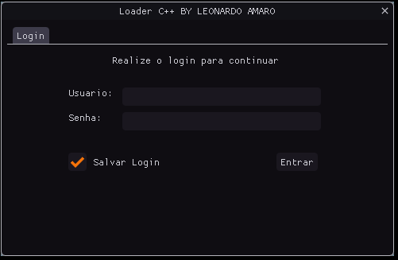
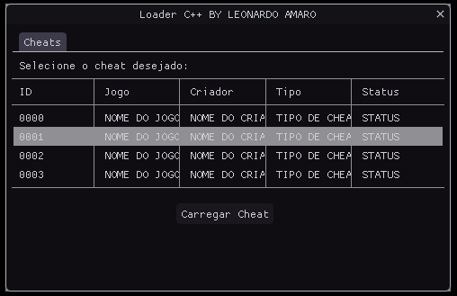

# Loader menu imgui with login integration IPS4

Loader with menu developed in c ++ using a login integration with the ips community of tools 4 and a fraud selector it has 2 forms, login and selector.
## Login Interface and Selector Interface:

Screenshots:

## Tutorial
- edit /PHP DOCUMENTS/conn.php
- upload in server /PHP DOCUMENTS/conn.php and /PHP DOCUMENTS/login.php
- open Loader-imgui-login-ips4/loader_c++/Loader C++/Loader_C++.vcxproj
- edit imgui_loader.cpp line 177 your path

## Crédits:  
[Leonardo Amaro](https://github.com/leonardoamaro-dev/)
[Darkratos](https://github.com/darkratos/)
[M47Z]()
[Luan Devecchi]()
[Dear Imgui](https://github.com/ocornut/imgui)
